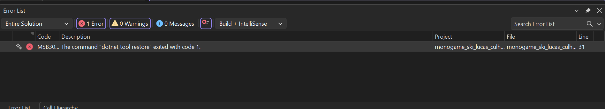
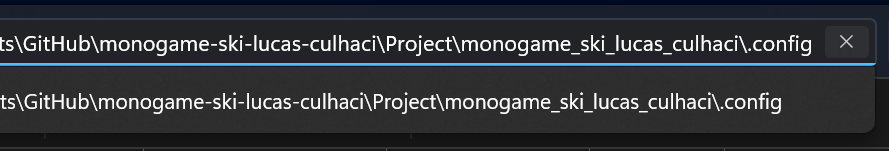

# HoGent – Softwareontwerp 2 - Monogame Ski

## Eindevaluatie – Semester 1 (2025)

Dit is de eindevaluatie voor het vak Softwareontwerp 2, gegeven door Tommy Uytterhaegen.

Dit project is gemaakt door Lucas Culhaci (202181086), Student Programmeren aan de HOGENT.

## Hoe speelt u dit spel?

1. Download de volledige repository.
2. Open het project in je IDE, gebruik "monogame_ski_lucas_culhaci.csproj".
3. Amuseer je!

### Mogelijke Errorberichten

> The command "dotnet tool restore" exited with code 1.

##### Hoe los je dit op?

1. Open de map monogame-ski-lucas-culhaci en ga naar de .config map. Indien deze niet zichtbaar is, kun je in de zoekbalk achter het huidige pad \.config typen en vervolgens op "enter" drukken.

1. Klik met de rechtermuisknop op het bestand dotnet-tools.json.

2. Kies eigenschappen (properties).

3. Onderaan 'Algemeen' zie je een melding staan: "Dit bestand is afkomstig van een andere computer...".

4. Vink het vakje deblokkeren (unblock) aan en klik op "OK".

# Contact

Bij eender welke probleem omtrent dit project kunt u een nieuwe issue aanmaken in deze GitHub-repository, of u kunt contact met mij opnemen via mail: lucas.culhaci@student.hogent.be

---

## Wat wordt verwacht

Voor de gekozen opdracht:

- Vul het formulier in  
  https://forms.cloud.microsoft/e/7mbRFJNGB7
- Plaats op GitHub:
  - de volledige broncode (MonoGame of MAUI)
  - Volledig klassendiagram
- Geef toegang tot de GitHub-repository aan tommy.uytterhaegen@hogent.be
- Dien de GitHub-link ook in via de opdracht op Chamilo
- De oplossing moet ten laatste doorgestuurd zijn op 5 januari 2026

## Evaluatie

De focus van deze opdracht ligt op softwareontwerp.  
Een verzorgde user interface is een goede oefening en wordt aangemoedigd, maar heeft geen invloed op de score.  
Forceer geen ontwerppatronen: gebruik wat zinvol en verdedigbaar is.
